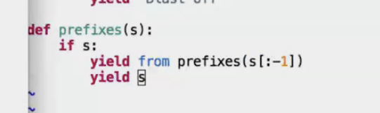
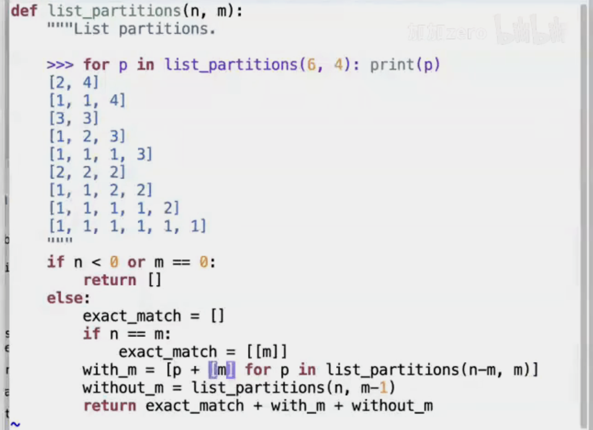
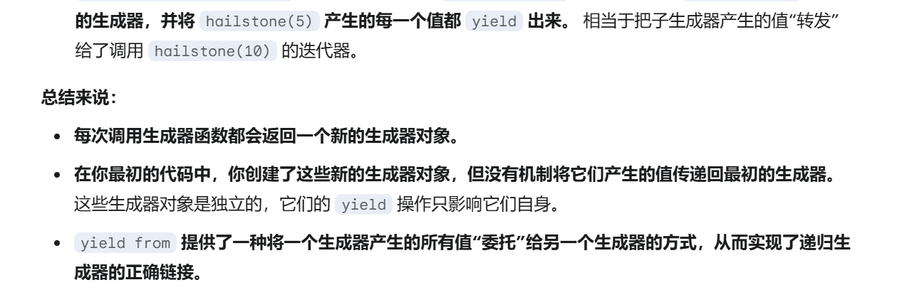
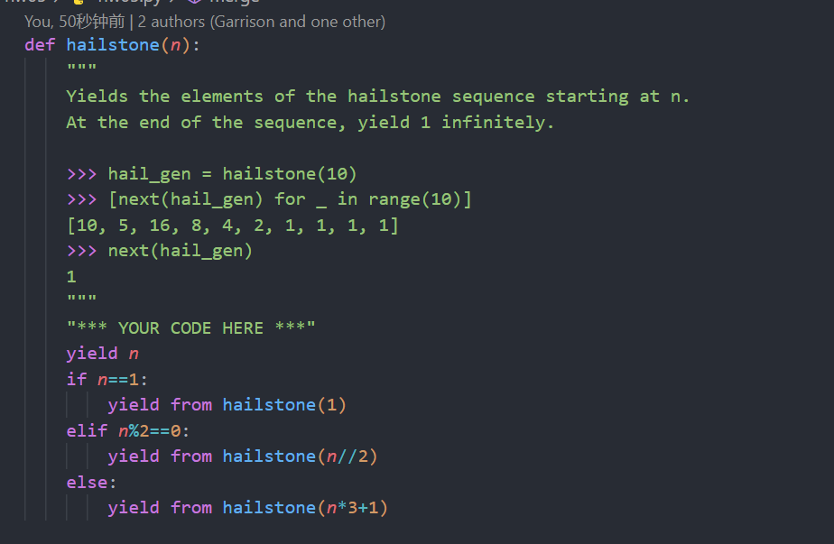
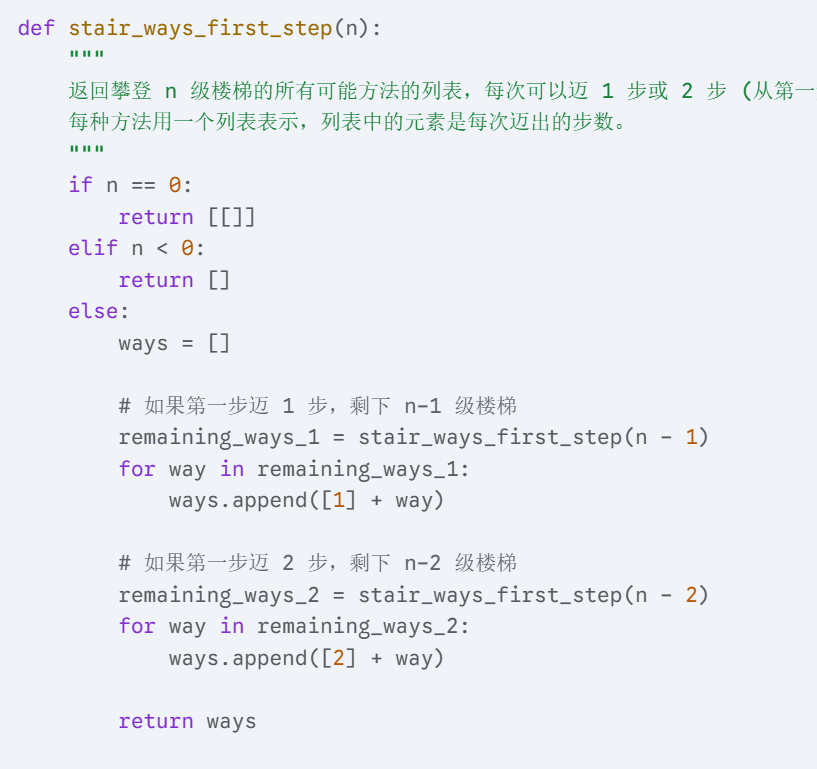
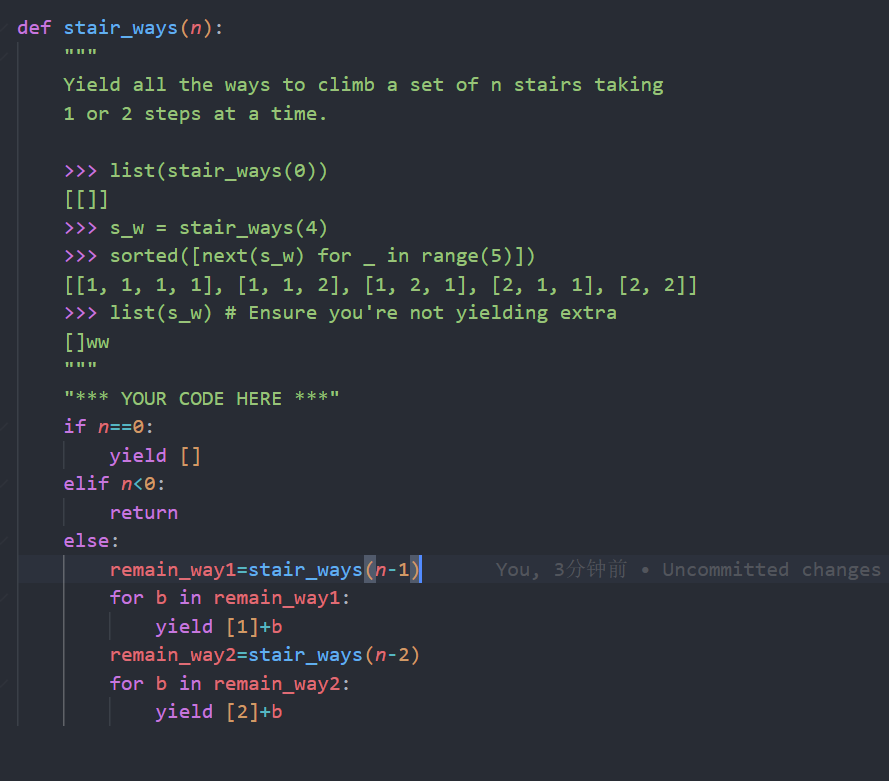

# generate

## yield

作用：在一个函数中使用yield语句，可以将函数变成一个生成器。生成器是一个迭代器，可以在每次调用时返回一个值，并在下次调用时从上次返回的地方继续执行。注意 for循环可以看出一个强制调用器

## 递归

也有靠归来的时候返回值的，比如

传递过程的递归belike

## 递归和迭代器

在递归的时候一定要注意yield from 这个关键字！

爬楼梯的递归！！！！

转换为yield的形式belike

