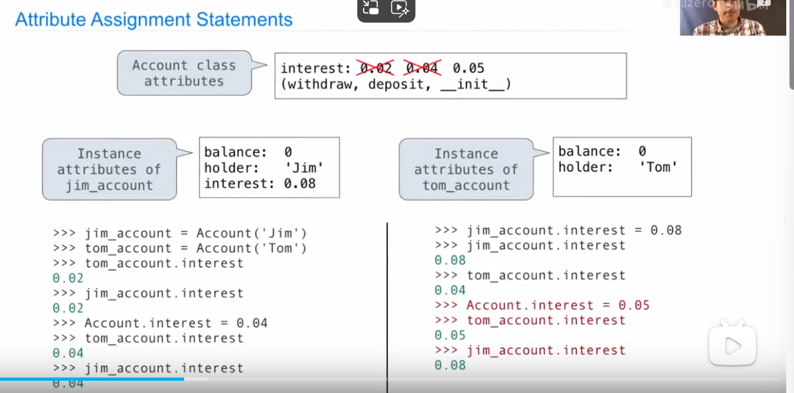
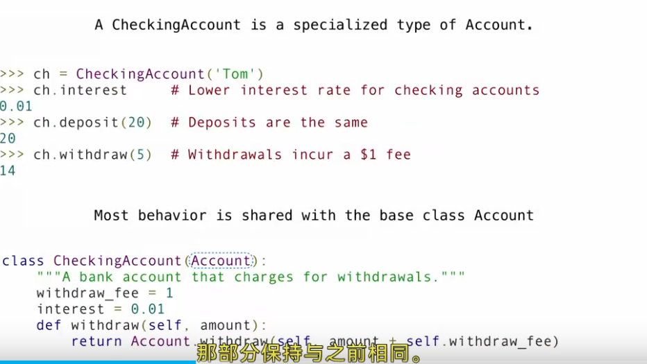
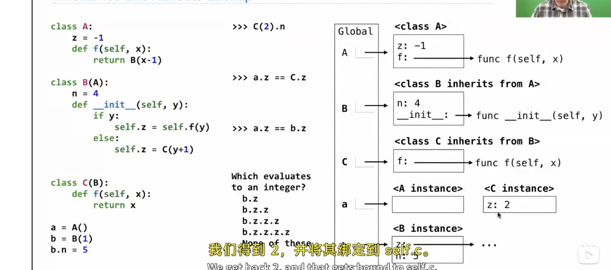

# Inheritance

## Attributes

实例的属性和类的属性是分开的，一半来说通过点方法来访问的值，会先访问实例的属性，如果没有找到，就会去访问类的属性。

## Inheritance

基本语法：class 子类(父类):
继承的好处：可以复用父类的代码，避免重复编写相同的代码。

## Composition
把另一个类作成一个属性
在类中，他首先会访问实例的属性，如果没有找到，就会去访问类的属性，如何再没找到会访问父类的属性

## mutable Inheritance

一个类可以继承多个类
  

- 
 

