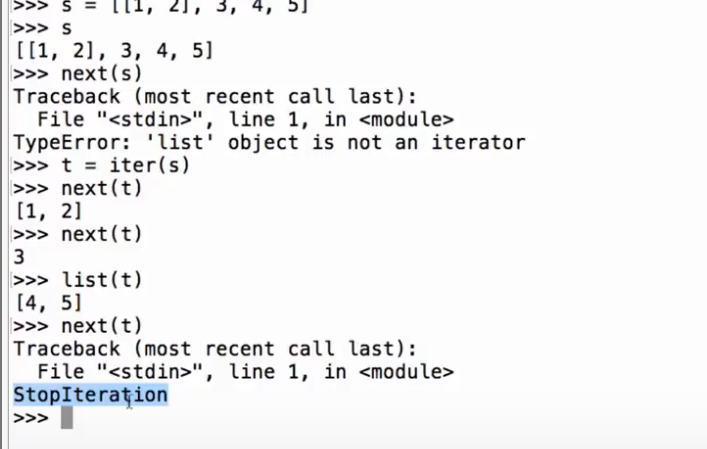
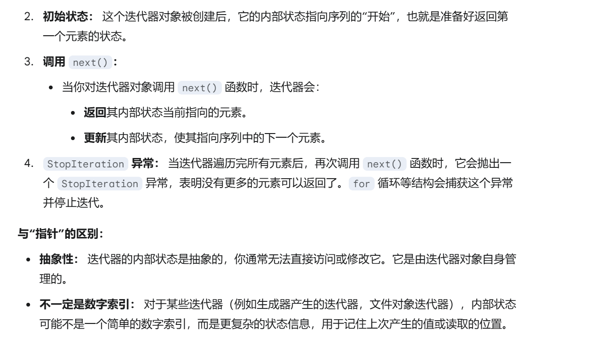
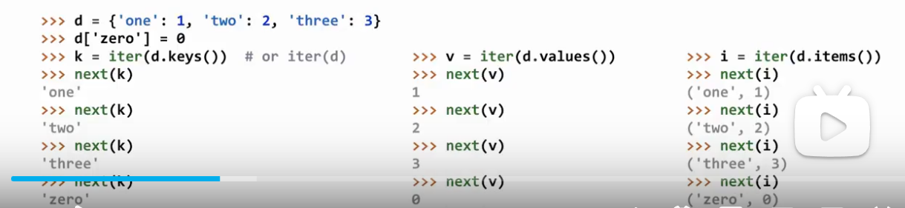
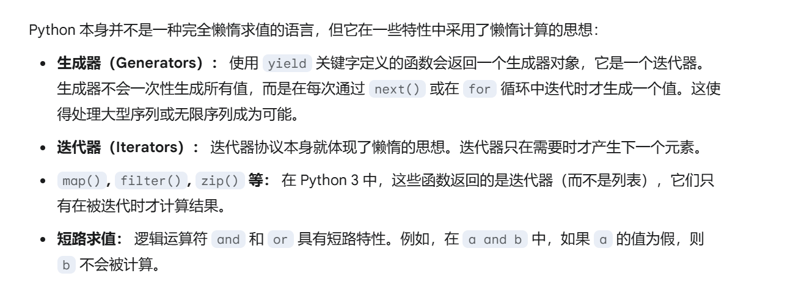
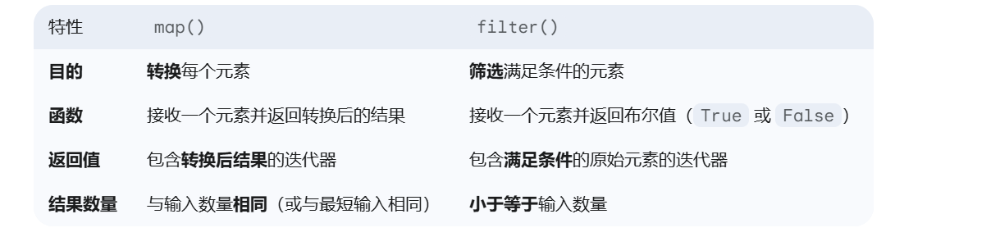
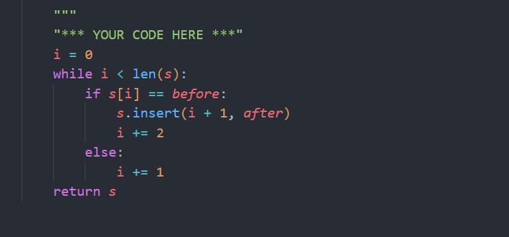

# Iterators

## iter

作用：接受一个容器（列表，字典），然后创建迭代器（Iterators）
基本语法： t=iter(.....)

## next

作用：接受一个迭代器，返回迭代器的下一个元素
基本语法： next(t)
当到最后一个元素的时候，会返回StopIteration错误
例子：

## reversed

作用反转

## all

作用：判断所有元素是否为真值

## dictionary

字典的顺序就是你输入值的顺序

## For statements

对于迭代器来说，用完就没有了，因此这时候用for语句只能循环iter（range（n））一次

range：range（start，end，step）
注意：end不包含，

## Iterators Functions

懒惰计算：

### map

语法：map(func,iter)
作用：对每一个元素都应用func函数，返回一个迭代器

### filter

语法：filter(func,iter)
作用：对每一个元素都应用func函数，返回一个迭代器
注意 filter更多是条件函数

### zip

语法：zip(iter1,iter2)
作用：将两个迭代器打包成一个迭代器
注意：如果两个迭代器长度不一样，那么就以最短的为准
例如（1，3）（2，4）
变成[[1,2],[3,4]]

## 练习

insert的作用以及注意点

