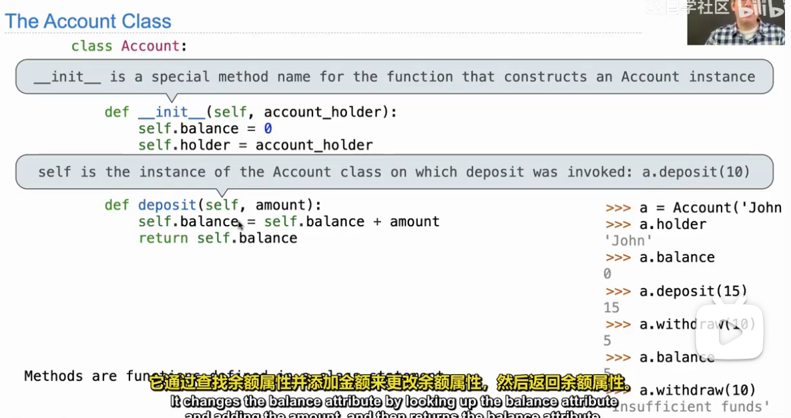

# Object

## class

- `class` 是一个语法结构，用于定义一个新的类型。
- 基本属性：def ——init——（self,数值）
- 注意在——init——定义的值是关于实例的值，而在其之外呢是静态的，是属于类的，所有类共有的。
- 

## methon and function

如果只是访问类的函数，这仅仅是一个函数，而访问类的对象的时候，这又变成了方法。值得一提的是在创建函数的时候传入的self是实例对象，而之后调用的时候通过.方法就不要传入self了

- 
- 
