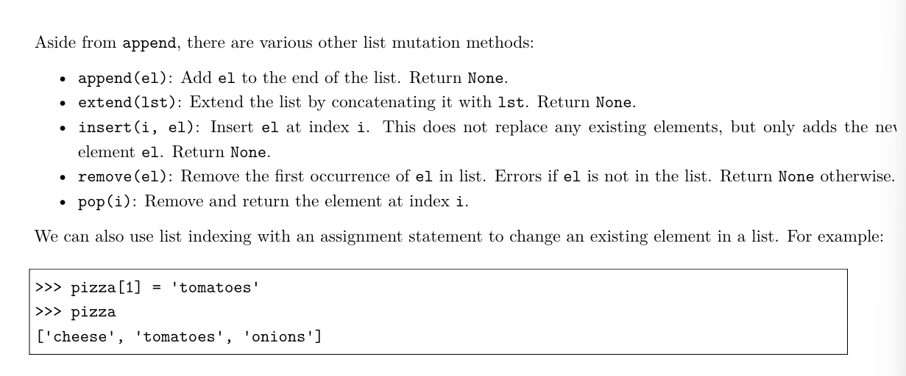

## Mutability

'''对于append,extend,insert,remove(移除第一个出现匹配的值的),pop(索引)'''

# Q1

值得注意的是，对于链表的加和，+= 和extend是一样的，都是在原链表上进行修改，而不是创建一个新的链表。但是如果x=x+[]，就会创建一个新的列表。
对于append来说，他添加的只是一个元素！包括列表
insert是在指定位置插入一个元素，一半在索引之后，
，

# Q4

切片s[::-1]是反转的意思,从末尾开始，步幅度是1

