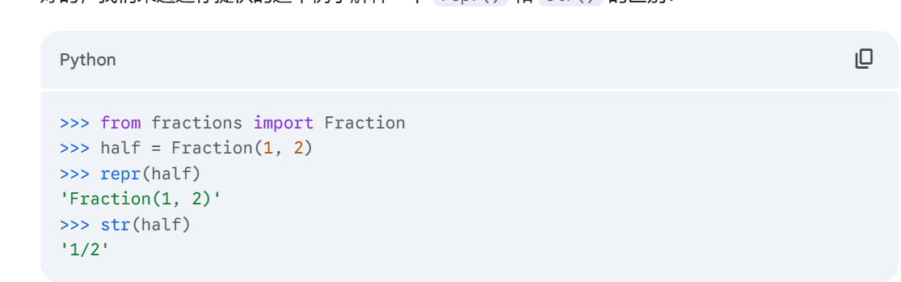
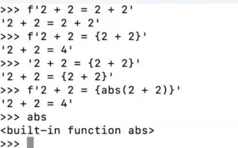

# representation

## repr&&str

repr()和str()的区别在于，repr()返回一个可以用来重新创建对象的字符串，而str()返回一个用户友好的字符串。通常，repr()用于调试和开发，而str()用于向用户显示信息。

## eval

eval()函数用于将字符串str当成有效的表达式来求值并返回计算结果。eval()函数的语法格式如下：
`eval(expression[, globals[, locals]])`
比如eval（“1+2”）输出3

## f-strings

基本语法：f"string{变量}"，作用可以将py表达式的值插入到字符串中
